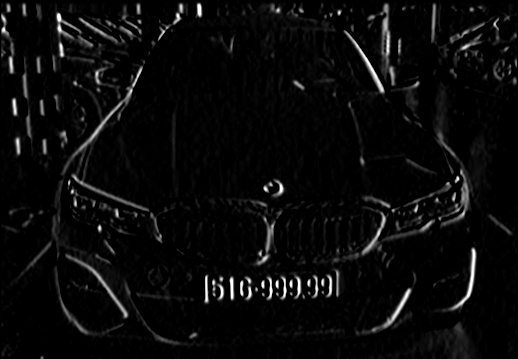

# Detect-licsence-plate by using opencv

Đây là một mini-project của tôi về nhận diện biển số ô tô sử dụng opencv-python 
- Cài requirements.txt rồi chạy file Gui.py để bắt đầu
- Opencv thì không quá tốt để dùng nhận diện nhưng bù lại thì thời gian để nhận diện nhanh hơn nhiều so với sử dụng yolo model.

# Quá trình detect:
- Đưa ảnh về gray scale rồi lấy sobel:

- Sau đó lấy ngưỡng thresh hold rồi close lại ta được:

- Bây giờ lấy contour và giới hạn các giá trị của contour ta sẽ được biển số cần tìm:

![plot][Imple/crop.jpg]

# Dưới đây là giao diện của app:

